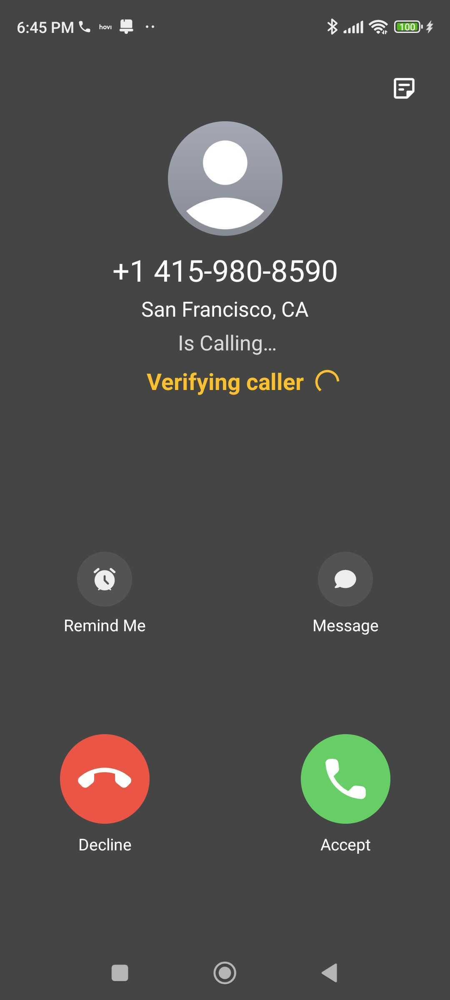
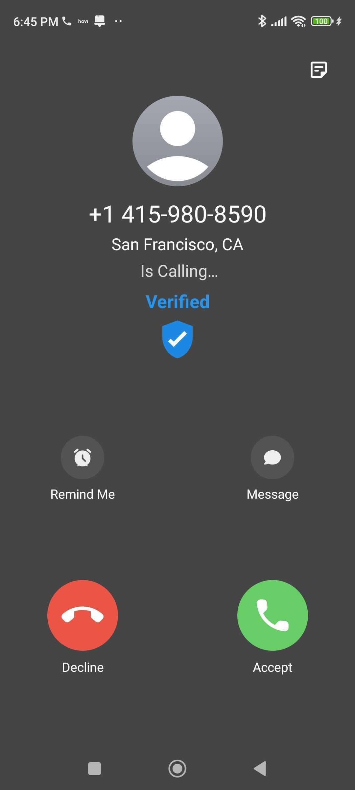

# vAI Dialer

This project is a fork of [Goodwy/Dialer](https://github.com/Goodwy/Dialer) and has been enhanced with self-sovereign identity capabilities using the Hovi Cloud Wallet API.

It serves as a demonstration for a Verifiable AI Call Agent. In this demo, when an AI sales agent calls you, the app verifies the agent's identity using verifiable credentials and DID-linked resources, ensuring trust and authenticity in the interaction.

Based on [Simple Dialer](https://github.com/SimpleMobileTools/Simple-Dialer).

This repository contains the frontend implementation for the cheqd verfiable AI hackathon project.
https://dorahacks.io/hackathon/cheqd-verifiable-ai/

## Screenshots

## Technologies used

- [cheqd](https://cheqd.io)
- [Hovi](https://studio.hovi.id)
- [Bland.ai](https://bland.ai)

## License

This project is licensed under the [GNU General Public License](LICENSE).